# Manual test report — Issue #202: contextual sign-in (share / sync)

| | |
|---|---|
| **Date** | 2026-07-31 |
| **Issue** | [#202 — Surface sign-in contextually at the moment of desire (share / sync), not during setup](https://github.com/timgent/pack-me-up/issues/202) |
| **PR** | [#278 — Ask for sign-in where it pays off, not during onboarding](https://github.com/timgent/pack-me-up/pull/278) |
| **Branch under test** | `claude/issue-202-c2vjto` @ `985974b` |
| **Tester** | Claude Code (agent), driving a real Chromium against a production build |
| **Result** | ✅ All success criteria met. One pre-existing behaviour worth noting (§7). |

## How this was tested

Not a mocked render — the built app (`npm run build`, served by `vite preview` on
`http://localhost:4173`) driven in a real Chromium, with a real
[Community Solid Server](https://github.com/CommunitySolidServer/CommunitySolidServer)
on `http://localhost:4001` for the sign-in half. A dedicated pod account
(`manual202@example.com` / pod `manual202`) was created for the run so nothing
was inherited from earlier state. Every browser context started empty — no local
data, no session, no storage.

Viewports: **1280×900** (desktop) and **390×844** (iPhone-class phone).

---

## 1. Onboarding never asks for a sign-in

Ran the wizard as a brand-new user and generated a question set.

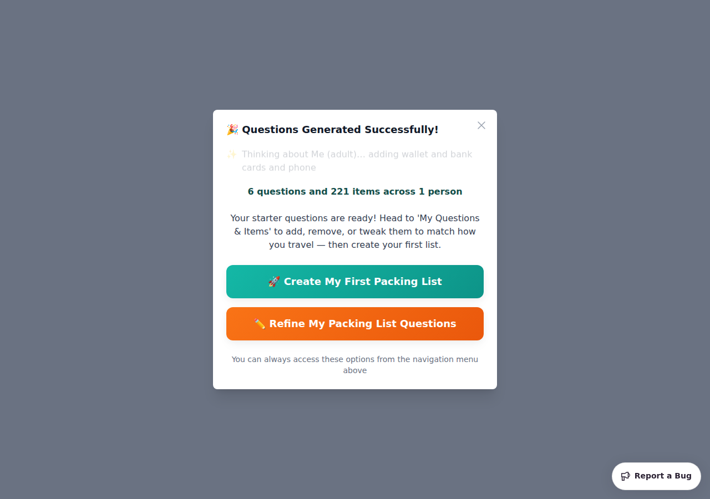

The summary and both CTAs are there; nothing asks about a Solid Pod. Clicking
**🚀 Create My First Packing List** goes straight to the list builder — the old
"🎉 Great! Your Questions Are Ready / Maybe Later" pod modal no longer appears
anywhere in the flow.

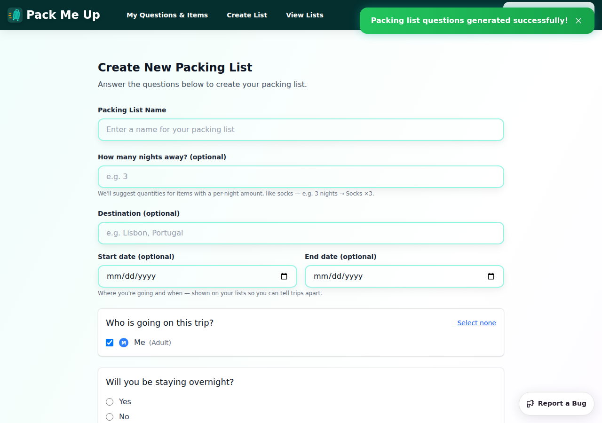

✅ *No sign-in prompt is forced during the wizard/onboarding.*

---

## 2. The lists index nudges once there is something to sync

Created **Lisbon Weekend**, then opened *View Lists*:

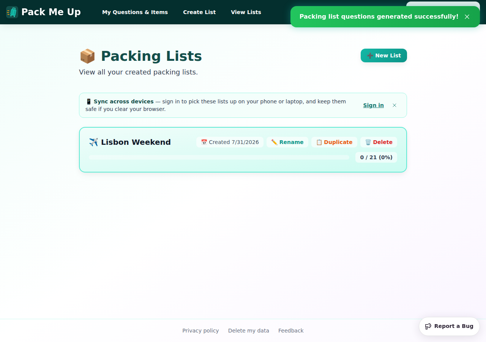

> 📱 **Sync across devices** — sign in to pick these lists up on your phone or
> laptop, and keep them safe if you clear your browser.  **Sign in** ✕

Subtle band above the cards, not a modal, and it does not push the list content
around. With **zero** lists the index shows only the "No packing lists found"
empty state — the nudge stays away until there is something worth syncing
(verified in this run and pinned by e2e `C11`).

✅ *A dismissible sync prompt appears on the lists index for logged-out users with ≥1 list.*

---

## 3. Dismissal holds for the session

Clicked the ✕:

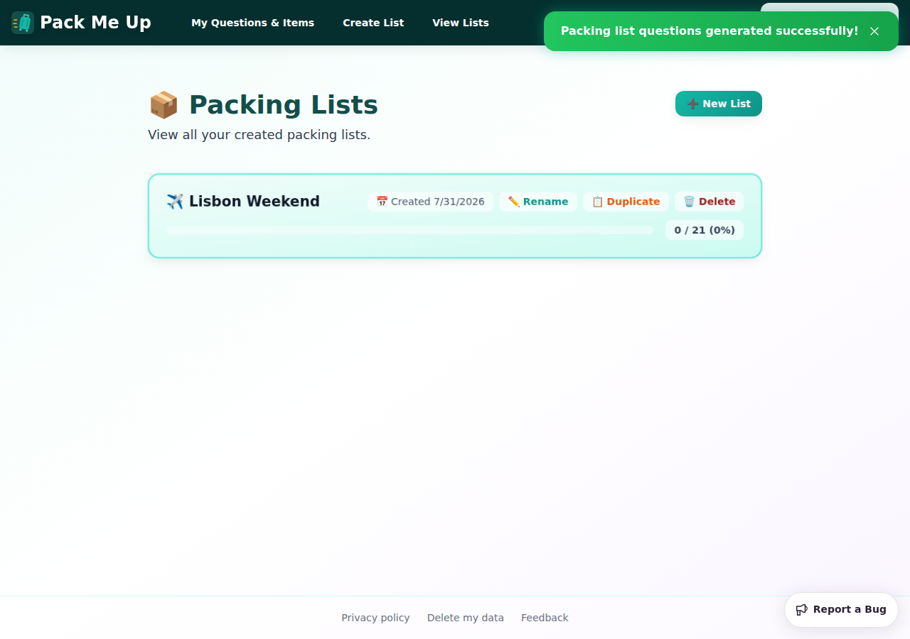

Then reloaded the page — same tab, same session:

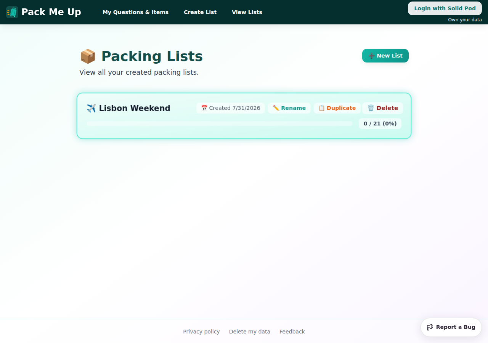

Still gone. It is stored in `sessionStorage`, so a "not now" holds for the whole
visit (including reloads and navigation) without silencing the prompt forever.

✅ *…and stays dismissed for the session.*

---

## 4. Share is offered while logged out, and the ask is framed around sharing

The **Share** button now sits in the list header for a logged-out user, next to
*Add Guest* and *Update from questions* (it used to be hidden entirely):

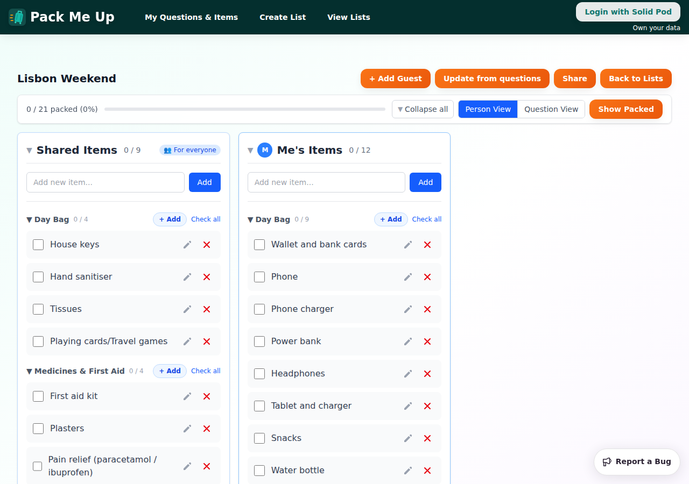

Clicking it:

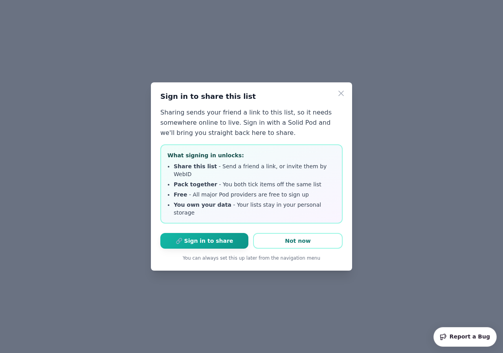

> **Sign in to share this list**
> Sharing sends your friend a link to this list, so it needs somewhere online to
> live. Sign in with a Solid Pod and we'll bring you straight back here to share.
>
> **What signing in unlocks:** Share this list · Pack together · Free · You own your data
>
> [🔗 Sign in to share] [Not now]

The ask names the payoff the user just reached for, rather than a generic "set up
a Solid Pod" pitch. **Not now** closes it and leaves the list untouched.
**🔗 Sign in to share** hands off to the provider picker:

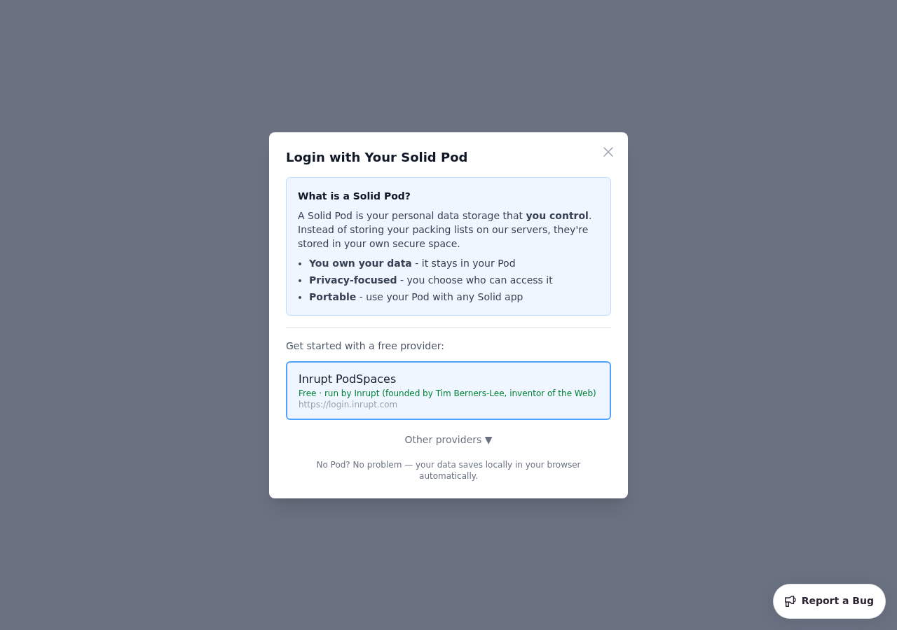

✅ *Attempting to share while logged out opens a benefit-framed sign-in prompt.*

---

## 5. Signing in returns the user to the share they were attempting

The interesting one. From the share prompt on **Lisbon Weekend**, chose a custom
provider (the local CSS) and went through a real OIDC login:


After authorising, the app comes back to the same list URL
(`#/view-lists/56fe3f39-…`) and **the share dialog is already open** — no hunting
for the Share button again:

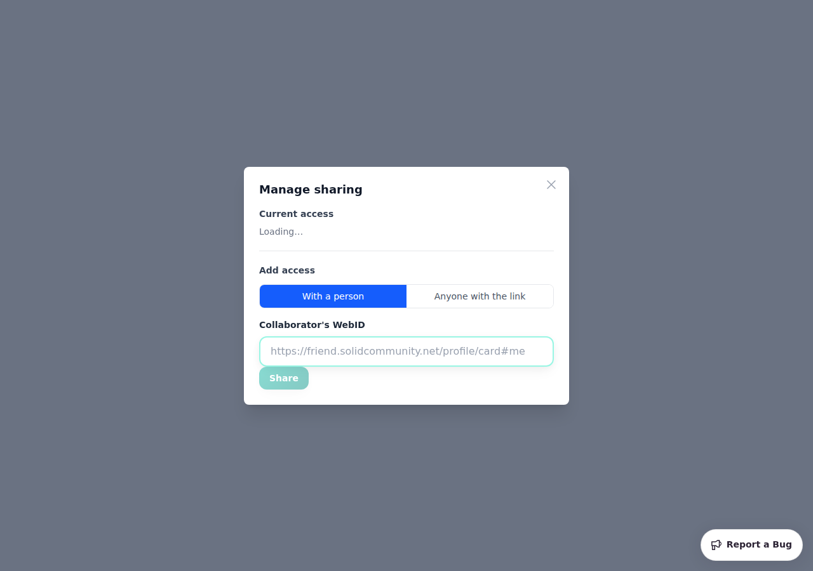

Carried on to prove the resumed action actually works end to end: *Anyone with
the link* → **Share publicly** produced a live link to the list on the pod:

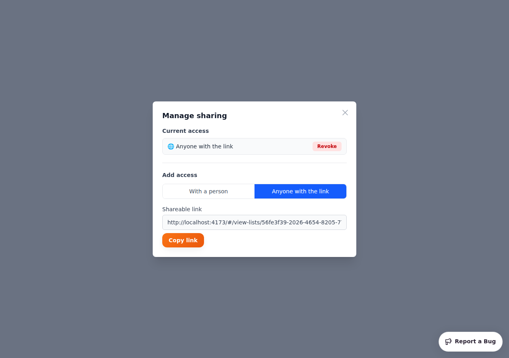

```
http://localhost:4173/#/view-lists/56fe3f39-2026-4654-8205-773bbacb9dd9
  ?pod=http%3A%2F%2Flocalhost%3A4001%2Fmanual202%2F
  &owner=http%3A%2F%2Flocalhost%3A4001%2Fmanual202%2Fprofile%2Fcard%23me
```

The pending intent is recorded in `sessionStorage` and consumed on arrival, so
it fires once and only for the list it was raised from.

✅ *After signing in via a contextual prompt, the user is returned to/continues their original action.*

---

## 6. Signed in → the nudge has nothing left to ask

Closed the share dialog and went back to the lists index while signed in:

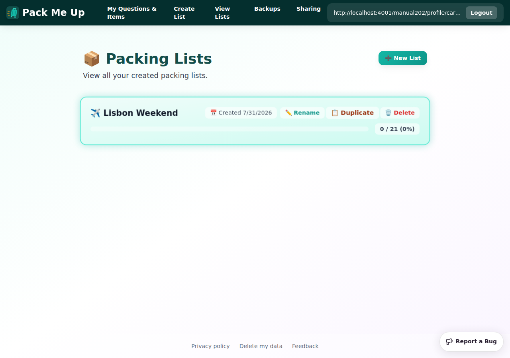

No sync band. (The list also shows its 🌐 Public badge from the share above.)

---

## 7. Note: first login still shows the migration prompt first

Not caused by this change, but it is what a real user hits on this path. Because
signing in for the first time with local data raises the existing "You have local
data" prompt, that modal lands **before** the resumed share dialog:

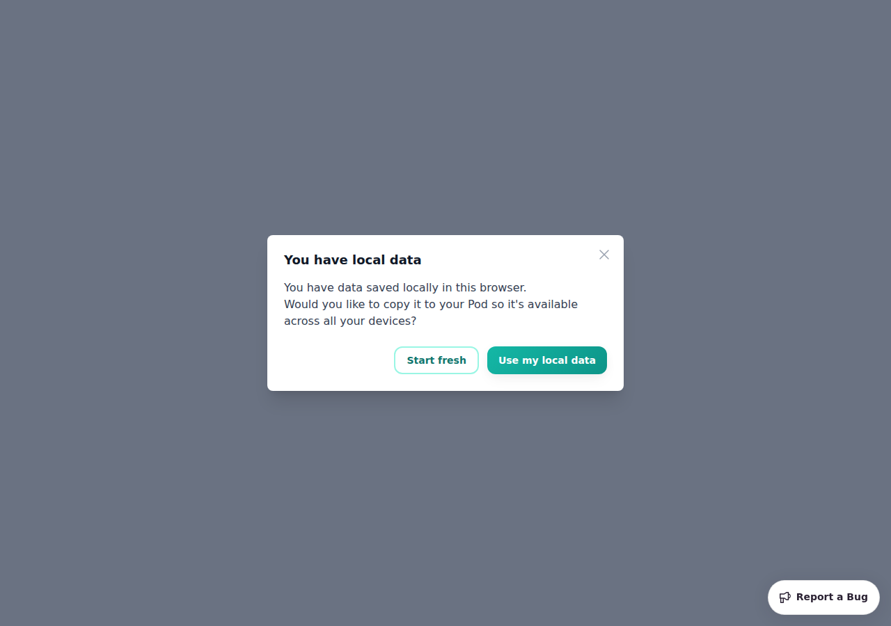

Answering it (**Use my local data**) reveals the share dialog underneath, as in
§5 — the share intent is not lost, just queued behind the migration question.
Worth knowing when reading the flow; only affects a user's very first sign-in.

---

## 8. Mobile (390×844)

Share prompt — modal fits the viewport, copy wraps, both buttons fully on screen
and tappable:

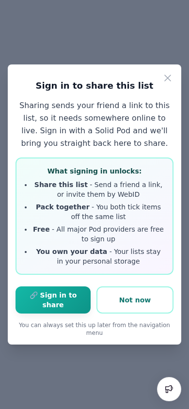

Sync nudge — wraps to two lines, controls drop to the right of the band, and the
✕ stays reachable. Measured box: `x=32, width=326` in a 390 px viewport, so no
horizontal overflow:

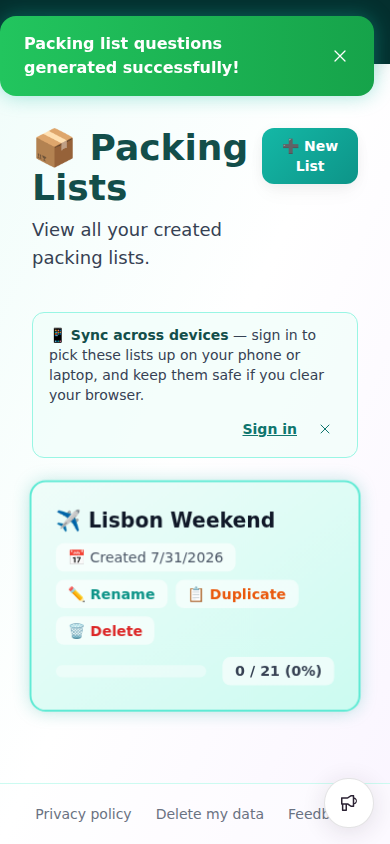

Dismissed on mobile, no layout jump in the cards below:

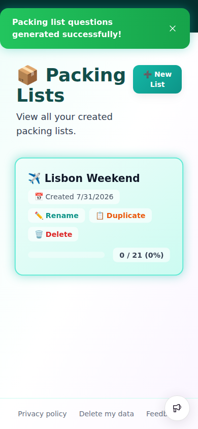

✅ *Contextual prompts verified on desktop and on mobile.*

---

## Success criteria

| Criterion | Result |
|---|---|
| Attempting to share while logged out opens a benefit-framed sign-in prompt | ✅ §4 |
| Dismissible sync prompt on lists index for logged-out users with ≥1 list, stays dismissed for the session | ✅ §2, §3 |
| After signing in via a contextual prompt, the user continues their original action | ✅ §5 |
| No sign-in prompt forced during the wizard/onboarding | ✅ §1 |
| Contextual prompts verified on desktop | ✅ §1–§6 |
| Contextual prompts verified on mobile (fits, dismiss reachable, no layout shift) | ✅ §8 |

## Automated checks alongside this run

- `npm test` (typecheck + vitest) — **1416 passed / 79 files**, including new unit
  tests for the pending-action store, the sync prompt, and the contextual share flow.
- Playwright e2e `a-onboarding`, `b-questions`, `c-packing-lists`, `i-migration` —
  **37 passed**, including new `C10`–`C13` covering the nudge lifecycle, the
  logged-out share prompt and both prompts at phone width.

## Bugs found

None. The migration-prompt ordering in §7 is pre-existing behaviour, not a
regression from this change.
