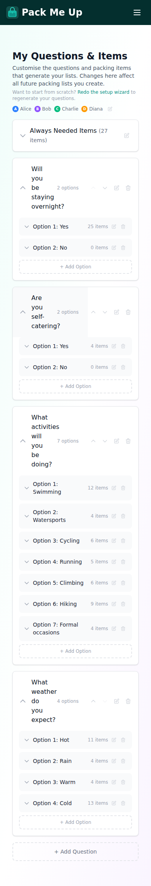
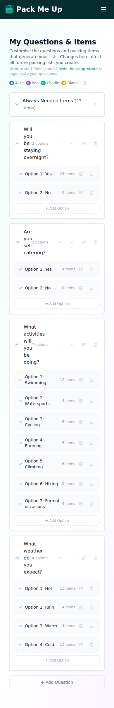
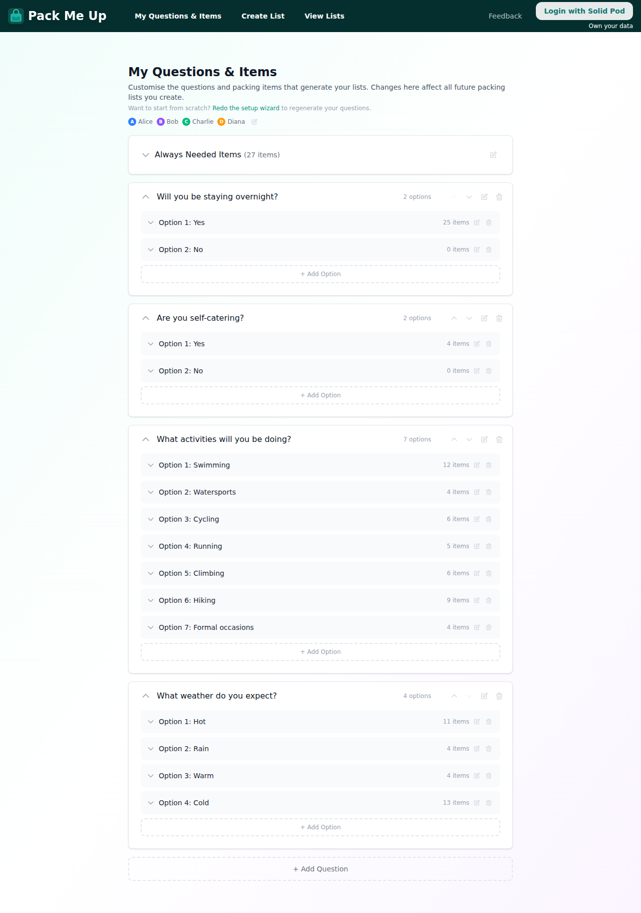
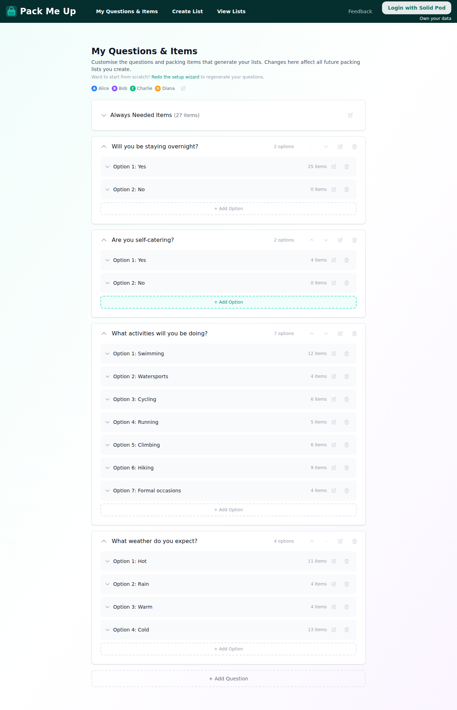
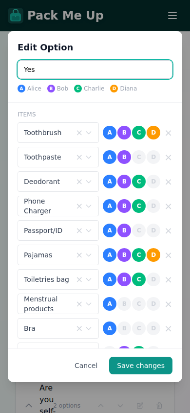

# Touch Target Improvements — manage-questions page

Mobile guidelines (Apple HIG, Android Material) recommend a minimum tap target
of **44 × 44 px**. Several icon buttons on the manage-questions page fell well
short of that, making them difficult to press without a precise tap.

---

## What was changed

### 1. Question row action buttons — move up/down, edit, delete

**Before:** `p-1.5` padding + `w-4 h-4` icon → ~28 px tap area  
**After:** `p-2.5` padding + `w-4 h-4` icon → ~37 px tap area

Because the question header uses `flex items-stretch`, increasing the button
padding also stretches the entire header row, which enlarges the expand/collapse
tap target simultaneously — a two-for-one improvement.

Gap between buttons widened from `gap-0.5` → `gap-1` so the larger buttons
have visual breathing room without touching.

### 2. Option row action buttons — edit, delete

**Before:** `p-1` padding + `w-3.5 h-3.5` icon → ~22 px tap area  
**After:** `p-2` padding + `w-4 h-4` icon → ~32 px tap area

Options live inside a collapsible section, so the slight increase in row height
is not visible until a user expands that section — minimal layout impact.

### 3. "Always Needed Items" edit button

**Before:** `p-1.5` padding → ~28 px tap area  
**After:** `p-2.5` padding → ~37 px tap area

### 4. "Edit people" pencil button in the people legend

Only the legend instance that carries an `onEdit` handler is interactive (the
read-only legend inside modals is unaffected).

**Before:** `p-1` padding + `w-3.5 h-3.5` icon → ~22 px tap area  
**After:** `p-2` padding + `w-4 h-4` icon → ~32 px tap area

### 5. Person-assignment avatar toggles inside the Edit Option / Always Needed modal

**Before:** `w-5 h-5` (20 px) fixed-size button — no padding  
**After:** `w-7 h-7` (28 px) — font size bumped from `text-[10px]` to `text-xs`

These appear in a horizontal flex row alongside a text input. Increasing the
circle diameter to 28 px keeps the row visually balanced while tripling the
tappable area. Still short of 44 px, but a significant improvement within the
constraint that the row must not overflow on small screens with four people.

---

## Screenshots

### Mobile (390 × 844)

| Before | After |
|--------|-------|
|  |  |

### Desktop (1280 × 900)

| Before | After |
|--------|-------|
|  |  |

### Edit Option modal — avatar toggles (mobile, after)

---

## What was intentionally left unchanged

- **`PersonDot`** in `ItemRow` — display-only, not interactive.
- **Legend avatars** inside `OptionEditModal` / `AlwaysNeededModal` — display-only.
- **`PersonLegend`** without an `onEdit` prop — renders no button at all.
- **Confirm-delete "Yes / No" buttons** — already use `px-2 py-1` text buttons,
  not icon-only, so they are easy enough to tap.
